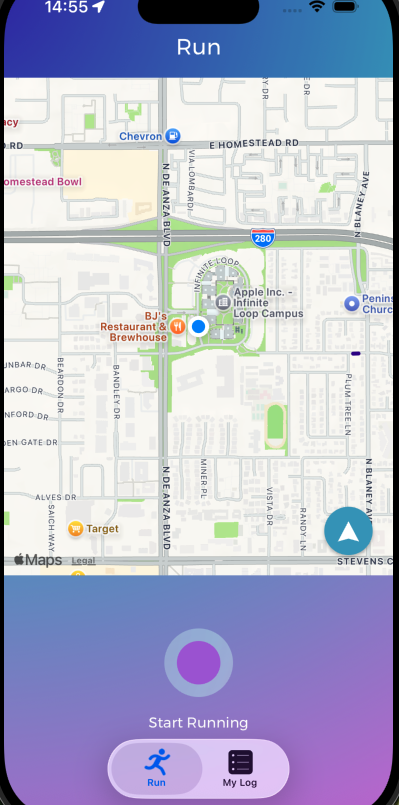
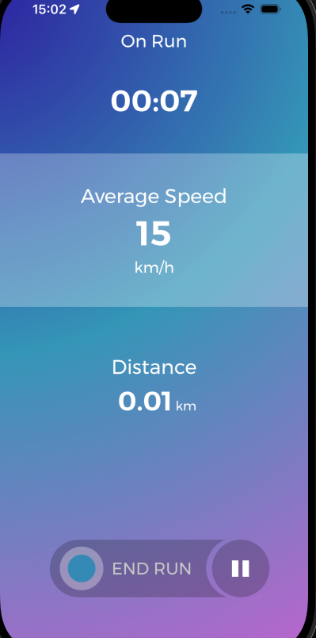
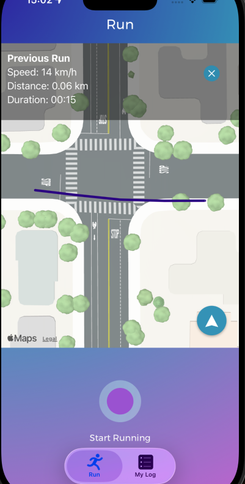
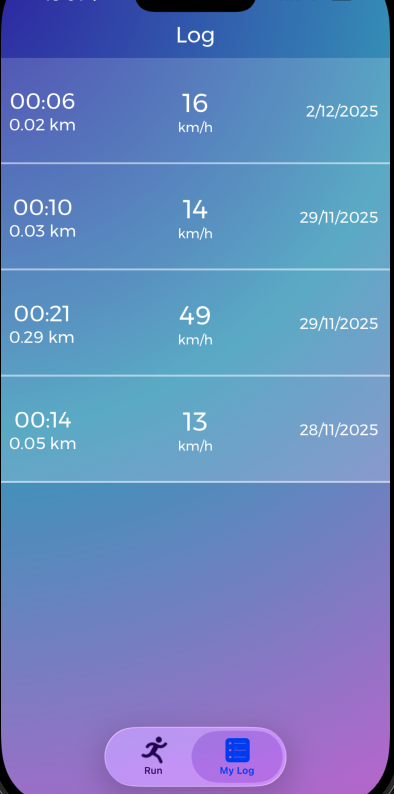

# RunApp 🏃‍♂️💨
A simple and clean iOS running tracker application built with Swift.  
RunApp allows users to track their runs, view distance, duration, and route on a map.

---

## 📌 About
RunApp is an iOS fitness application designed to help users track their running sessions using CoreLocation and MapKit.  
Users can start a run, pause it, view real-time distance, time, and see their completed route.

---

## ✨ Features
- 🏃 Track running sessions  
- 📍 Real-time location tracking (CoreLocation)  
- 🗺 Route drawing on map (MapKit)  
- ⏱ Duration & distance calculation  
- 📊 Run history list  
- 🧭 Location permission handling  
- 🌐 Works on device; simulator may show incorrect location

---

## 🚀 Installation
```bash
git clone https://github.com/CanHaskan/RunApp.git
cd RunApp
```

Then open the project:
```
RunApp.xcodeproj
```

---

## ⚙️ Requirements
- iOS 15+
- Xcode 14+
- A physical iPhone is recommended for accurate GPS tracking  
  *Simulators always use fake/US locations*

---

## 🧰 Usage
1. Open the app  
2. Allow location permissions  
3. Tap **Start Run**  
4. Track:
   - Distance  
   - Duration  
   - Route  
5. Tap **Finish** to save the run  
6. View your run history

---

## 📸 Screenshots

🟢 Begin Run (BeginRunVC)
The screen you see before starting a run.



🟡 Current Run (CurrentRunVC)
The preparation screen you see before starting a run.



🔵 Last Run (This is the same VC as BeginRunVC)
Live tracking screen showing time, distance, and speed during the run.



🟣 Run Log (RunLogVC)
Summary of your most recent completed run: speed, distance, duration, and date.



---

## 📂 Project Structure
```
RunApp/
 ├─ AppDelegate.swift
 ├─ SceneDelegate.swift
 ├─ Controller/
 ├─ View/
 ├─ Model/
 ├─ Services/
 ├─ Utilities/
 ├─ Assets.xcassets
 └─ Info.plist
```

---

## 📄 License
MIT
